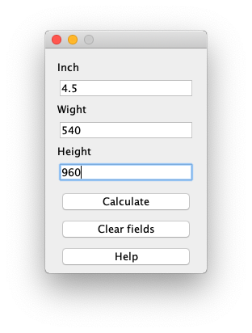
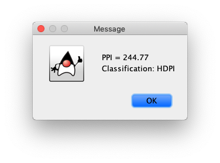

# ppi-calculator

The PPI Calculator allows you to calculate the pixels per inch of your display based on its dimensions and the pixel count.

Pixels per inch (PPI) is measurement of the pixel density (resolution) of an electronic image device, 
such as a computer monitor or television display, or image digitizing device such as a camera or image scanner.

The calculator uses this formula to calculate the PPI:

`ppi = Sqrt((width^2 + height^2) / inch^2)`

* width - screen width in pixels
* height - screen height in pixels
* inch - screen diagonal in inches

You can also get a classification of your display by the calculated PPI:
* None (PPI < 120)
* LDPI (PPI = 120 or PPI > 120 and PPI < 160)
* MDPI (PPI = 160 or PPI > 160 and PPI < 240)
* HDPI (PPI = 240 or PPI > 240 and PPI < 320)
* XHDPI (PPI = 320 or PPI > 320 and PPI < 480)
* XXHDPI (PPI = 480 or PPI > 480 and PPI < 640)
* XXXHDPI (PPI = 640 or PPI > 640)

## Demo

 

## Developed By

Dmitry Kologrivko  - <dmitrykologrivko@gmail.com>